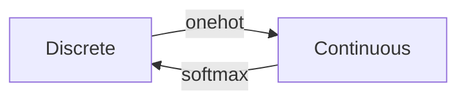

# Edx_ML_intro

------------------------------------------------------------------------------------
## Unit 0. Python set up

conda updates:  
https://github.com/ContinuumIO/anaconda-issues/issues/12135 [bluesblaz]  
https://stackoverflow.com/questions/45197777/how-do-i-update-anaconda  

Install packages:  
1. anaconda prompt:   
-activate (environment)  
-conda install ...  
2. Anaconda   

Pycharm
1. add configuration: add new-- choose python-- find the path to the xxx.py file  
2. add interpreter: excutable conda: select "conda.exe", chech the path by "which conda" in anaconda prompt.  
3. check the interpreter in the configuration  

------------------------------------------------------------------------------------
## Unit 1. Linear classifier
#-----------------------------------------------------------------------------------# 
### L1. l2. linear classifiers 
A linear classifier $h, h(x; \theta_0, \theta) = sign(\theta \cdot x + \theta_0)$, i.e. the sign of the dot product of $\theta$ and $x$ plus $\theta_0$.   
Linear separability: $y_i \cdot h(x_i) > 0$ for all $i$.  

(1) Algorithm:    
Training error: $\varepsilon_n(\theta_0, \theta) = \frac{1}{n} \ \Sigma_{i=1}^n \[\[ y^{(i)} \\cdot (\theta \cdot x^{(i)} + \theta_0) \leq 0 \]\]$  
where $\[\[ \cdot \]\]$ returns 1 if the logical expression in the argument is true, and zero otherwis  

Learning algorithm:
 1)***Perceptron Algorithm***      
initialize $\theta$ and $\theta_0$ with 0  
> $\theta$ = $\theta$ (vector)  
> $\theta_0$ = 0 (scalar)  
> totally T epoches to iterate  
>> for t = 1 .. T do                       
>> (totally m data points)         
>>> for i = 1 .. m do    
>>> (misclassify data points)                             
>>> if $y^{(i)} \\cdot (\theta \cdot x^{(i)} + \theta_0) \leq 0$        
>>> then  
>>> $\ \theta  = \theta + y^{(i)} \cdot x^{(i)}$   
>>> $\ \theta_0 = \theta_0 + y^{(i)}$   
>return $\theta, \theta_0$  \


2）***Pegasos Algorithm***  
if $y^{(i)} \cdot (\theta \cdot x^{(i)}) \leq 1$, then update $\theta = (1 - \eta \lambda) \theta + \eta y^{(i)} x^{(i)}$; else, update $\theta = (1 - \eta \lambda) \theta$


#-----------------------------------------------------------------------------------# 
### Lecture 3. Hinge loss, Margin boundaries and Regularization
***Decision boundary*** is the set of points $x$ which satisfy: $\theta \cdot x + \theta_0 = 0$   
***Margin Boundary*** is the set of points $x$ which satisfy: $\theta \cdot x + \theta_0 = \pm 1$    
So, the distance from the decision boundary to the margin boundary is $\frac{1}{||\theta||}$.   

***Regularization***:  $max \lbrace\frac{1}{||\theta||}\rbrace$ = $min \lbrace\frac{1}{2}||\theta||\rbrace$      
***Hinge loss***: $Loss_h (y^{(i)} \\cdot (\theta \cdot x^{(i)} + \theta_0)) = 0, (if \ z \geq 1); 1-z, (if \ z < 1)$, where $z = y^{(i)} \\cdot (\theta \cdot x^{(i)} + \theta_0)$     
***Objectives = average loss + regularization***        
$J(\theta, \theta_0) = \frac{1}{n} \Sigma_{i=1}^n Loss_h (y^{(i)} \\cdot (\theta \cdot x^{(i)} + \theta_0)) + \frac{\lambda}{2}||\theta||^2$,
where average loss: $\frac{1}{n} \Sigma_{i=1}^n Loss_h (y^{(i)} \\cdot (\theta \cdot x^{(i)} + \theta_0))$, regularization term: $\frac{\lambda}{2}||\theta||^2$, regularization paramter: $\lambda > 0 $.   


#------Lecture 4. Linear Classification and Generalization ------#      
Split training set into training set + validation set, and assess the loss of validation set.   

***Gradient descent***: Start $\theta$ at an arbitrary location: $\theta \leftarrow \theta_{start}$,    
update $\theta$ repeatedly with $\theta \leftarrow \theta - \eta \frac{\partial J(\theta, \theta_0)}{\partial \theta}$ until $\theta$  does not change significantly.  

***Stochastic gradient descent***: (looking at each individual item randomly) With stochastic gradient descent, we choose $i \in {1, ..., n}$ at random and update $\theta$ such that     
$\theta \leftarrow \theta - \eta \nabla \[Loss_h (y^{(i)} \\cdot (\theta \cdot x^{(i)} + \theta_0)) + \frac{\lambda}{2}||\theta||^2\]$    
if loss > 0: $\theta \leftarrow \theta - \eta (- y^{(i)} \cdot x^{(i)} + \lambda \theta)$;  
if loss = 0, $\theta \leftarrow \theta - \eta \lambda \theta$.   
Differently from perceptron, $\theta$ is updated even when there is no mistake.    


***Support vector machine***: SVMs can efficiently perform a non-linear classification using what is called the kernel trick, implicitly mapping their inputs into high-dimensional feature spaces.


#-----------------------------------------------------------------------------------# 
### Lecture 4. Tuning the Regularization Hyperparameter by Cross Validation 
***Supervised Learning***     
Objective function (J = Loss + regularization($\alpha$R)) --> hyperparameter ($\alpha$, not determined through the optimization of J) --> cross validation     

(1) Support Vector Machine --> maximize the margin (more generalization)    
$D: {(x_i, y_i)} \ i = 1, 2, ..., n$   
distant from point i to the decision boundary: $\gamma = \frac{y_i \cdot \ (\theta \cdot x_i + \theta_0)}{||\theta||}$    
margin, $d = \min_{x_i, y_i \in D} \ \gamma (x_i, y_i, \theta, \theta_0)$

***Objective function = hinge loss + regularization***
***hinge loss*** = $L_h = f(\frac{\gamma}{|gamma_{ref}}) = 1 - \frac{\gamma}{|gamma_{ref}}, \gamma \leq \gamma_{ref}; 0, \ o.w $  


***objective function***     
$J(\theta, \theta_0) = \frac{1}{n} \Sigma_{i=1}^n Loss_h (\frac{\gamma}{\gamma_{ref}}) + \alpha \frac{1}{||\gamma||^2}$   

--> Maximize the margin   
$\theta$ can be scaled by any constant w.o changing the decision boundary.
$\gamma_{ref} = \frac{y^M \cdot \ (\theta \cdot x^M + \theta_0)}{||\theta||}$    
scale $\theta$ st. $(y^M \cdot \ (\theta \cdot x^M + \theta_0) = 1$    
therefore, $\gamma_{ref} = \frac{1}{\theta_0}$   
$J(\theta, \theta_0) = \frac{1}{n} \Sigma_{i=1}^n Loss_h (y^{(i)} \cdot (\theta \cdot x^{(i)} + \theta_0)) + \alpha ||\theta||^2$   

(2) Cross validation --> get $\alpha$   
n: segments      
   
accuracy score: $S(\alpha) = \frac{1}{n} \Sigma_{i=1}^n S(\alpha_i)$    
$\alpha^{\*} = argmin_{\alpha} S(\alpha)$ 


------------------------------------------------------------------------------------
## Unit 2. Nonlinear Classification, Linear regression, Collaborative Filtering
#-----------------------------------------------------------------------------------#  
### Lecture 5. Linear regression
(1) ***Objective***   
1) Empirical risk 
$R_n (\theta) = \frac{1}{n} \Sigma_{i=1}^n Loss(y^{(i)} - \theta \cdot x^{(i)})$   
- Squared error loss 
$Loss(z) = \frac{z^2}{2}$       
$R_n (\theta) = \frac{1}{n} \Sigma_{i=1}^n Loss(y^{(i)} - \theta \cdot x^{(i)}) = \frac{1}{n} \Sigma_{i=1}^n \cdot \frac{1}{2} (y^{(i)} - \theta \cdot x^{(i)})^2$   
- Hinge loss  
$Loss_h (z) = 0, if z \geq 1; 1-z, o.w$

(2) ***Learning Algorithm***: gradient based approach   
$\nabla_{\theta} \ \frac{1}{2} (y^{(i)} - \theta \cdot x^{(i)})^2 = -(y^{(i)} - \theta \cdot x^{(i)}) \cdot x^{(i)}$  
initialize: $\theta = 0$     
learning step: $\theta = \theta + \eta (y^{(i)} - \theta \cdot x^{(i)}) \cdot x^{(i)}$   

SGD vs GD: Remark on SGD versus GD: Stochastic gradient descent (SGD) and gradient descent (GD) differ in their batch sizes. For "very" convex problems, GD can converge in fewer steps than SGD (with the same timesteps for fair comparison, and also taking moving averages of SGD's answer, for fair comparison). But for general nonlinear problems, we can't make a universal claim about which takes fewer steps to converge. For example, the randomness in SGD can help us escape critical points such as saddle points that would get GD stuck.    

(3) ***Closed form solution***        
$\nabla_{n}(\theta) = - \frac{1}{n} \Sigma_{i=1}^n (y^{(i)} - \theta \cdot x^{(i)}) \cdot x^{(i)} = 0$,      
if $x_1, ..., x_n \ in \ ℝ^d, n ≫ d, then \ \theta = A^{-1} b, where \ A = \frac{1}{n} \Sigma_{i=1}^n x^{(i)} (x^{(i)})^T, b = \frac{1}{n} \Sigma_{i=1}^n y^{(i)} x^{(i)}$  

(4) ***Regularization*** (Ridge and Lasso)        
***Ridge Regression***    
$J_{\lambda, \theta} (\theta) = R_n(\theta) + \frac{\lambda}{2} ||\theta||^2$    
learning step: $\theta = (1 - \eta \lambda) \theta + \eta (y^{(i)} - \theta \cdot x^{(i)}) \cdot x^{(i)}$      

#-----------------------------------------------------------------------------------# 
### Lecture 6. Non-linear classifier     
(1) Higher order feature vectors         
map $x \in \ ℝ^d$ to $\phi(x) \in ℝ^p$     
e.g $\phi(x) = \[\phi_1(x), \phi_2(x)\]^T = \[x, x^2\]^2$   
$\phi(x) = \[x_1, x_2, x_1^2 + x_2^2\]^T$: hyperbolic paraboloid

(2) Non-linear classifier     
$h(x; \theta, \theta_0) = sign(\theta \cdot \phi(x) + \theta_0)$    

(3) Kernels (inner product)   
Computing the inner product of two feature vectors can be computationally cheap.     
$\phi(x) = \[x_1, x_2, x_1^2 + x_2^2 + \sqrt{2} x_1 x_2\]^T$    
$\phi(x') = \[{x'}_1, {x'}_2, {x'}_1^2 + {x'}_2^2 + \sqrt{2} {x'}_1 {x'}_2\]^T$     
$K(x, x') = \phi(x) \cdot \phi(x') = (x, x') + (x, x')^2$    

In general, $K(x, x') = \phi(x) \cdot \phi(x') = (1 + x x')^p, p = 1, 2,...$   

Example kernel: https://stats.stackexchange.com/questions/152897/how-to-intuitively-explain-what-a-kernel-is       
$k(x, y) = \phi(x)^T \phi(y) = (1 + x^T y)^2, \ with \ x,y \in ℝ^2, x=(x_1, x_2), y=(y_1, y_2)$, get expression for $\phi(x)$     
$k(x, y) = (1 + x^T y)^2 = (1 + x_1 y_1, x_2 y_2)^2 = 1 + x_1^2y_1^2 + x_2^2y_2^2 + 2x_1 y_1 + 2x_2 y_2 + 2x_1x_2y_1y_2$      
Therefore $\phi(X) = \phi(x_1, x_2) = (1, x_1^2, x_2^2, \sqrt{2} x_1,  \sqrt{2} x_2,  \sqrt{2} x_1 x_2)$

(4) Kernel Perceptron Algorithm    
From ***Perceptron algorithm***, we get $\theta = \Sigma_{j=1}^n \alpha_j y^{(j)} \phi(x^{(j)})$    
$initial \ \theta = 0$   
$run \ through \ i = 1, ..., n$   
$\ if \ y^{(i)} \theta \cdot \phi(x^{(i)}) \leq 0,$   
$\ \ \theta \leftarrow \theta + y^{(i)} \phi(x^{(i)})$    
Here, $\theta \cdot \phi(x^{(i)}) = \Sigma_{j=1}^n \alpha_j y^{(j)} \phi(x^{(j)}) \cdot \phi(x^{(i)}) = \Sigma_{j=i}^n \alpha_j y^{(j)} \cdot K(x^{(j)}, x^{(i)})$   

(5) Kernel composition rules     
-  $K(x, x') = 1$ is a kernel.
-  Let $f: ℝ^d \rightarrow ℝ$ and $K(x, x')$ is a kernel, then so it $\tilde{K}(x, x') = f(x) K(x, x') f(x')$.
-  If $K_1(x, x')$ and $K_2(x, x')$ are kernels,  $K_1(x, x') + K_2(x, x')$ is a kernel.
-  If $K_1(x, x')$ and $K_2(x, x')$ are kernels,  $K_1(x, x') \cdot K_2(x, x')$ is a kernel.

(6) Radial basic kernel   
Ref: https://www.cs.toronto.edu/~duvenaud/cookbook/   
$K(x, x') = \exp{(- \frac{1}{2} ||x - x'||^2)}$

(7) Other non-linear classifier: random forest


#-----------------------------------------------------------------------------------# 
### L7. Recommender System

(1) K-Nearest Neighbor Method    
$\hat{Y_{ai}} = \frac{\Sigma_{b \in KNN(a)} \ sim(a, b) Y_{bi}}{\Sigma_{b \in KNN(a)} \ sim(a, b)}$        
$sim(a, b)$ can choose euclidean distance ||x_a - x_b||, cosince similarity $cos(\theta) = \frac{x_a \cdot x_b}{||x_a|| \cdot ||x_b||}$, etc.      

Drawbacks: need to manually compute the similarities, can be very difficult to features similarities in subgroups.   

(2) Collaborative filtering
1) Naive approach (very bad performance)
Considering the objectives of linear regression:     
$J(X) = \Sigma_{a, i \in D} \frac{(Y_{ai} - X_{ai})^2}{2} + \frac{\lambda}{2} \Sigma_{(a,i)} X_{ai}^2$.    
For $X_{ai} \in D$, $\frac{\partial{J}}{\partial{X_{ai}}} = (1 + \lambda) X_{ai} - Y_{ai}$, therefore $X_{ai} = \frac{Y_{ai}}{1 + \lambda}$.    
For $X_{ai} \notin D$, $\frac{\partial{J}}{\partial{X_{ai}}} = \lambda \cdot X_{ai}$, therefore $X_{ai} = 0$.    

2) Collaborative Filtering with Matrix Factorization    
Assumption: X is low rank    
Rank 1: O(n, m) --> O(n + m), $X = UV^T$, $X_{ai} = u_a \cdot v_i$ (oversimplification)   
Rank 2: $X = UV^T$, $X \in ℝ^{a \times i}, U \in ℝ^{a \times 2}, V \in ℝ^{i \times 2}$   
...  

(3) Alternating minimization    
assume $X_{ai} = u_a v_i$ rank 1,   
$J(U, V) = \Sigma_{(a, i) \in D} (y_{ai} - u_a v_i)^2 + \frac{\lambda}{2} \Sigma_{a=1}^n u_a^2 + \frac{\lambda}{2} \Sigma_{i=1}^n v_i^2$    
start with an initial $v$ (random initialization)--> solve $u'$, and input $u'$ --> solve $v'$ --> iritate until converge    


#-----------------------------------------------------------------------------------# 
### Python Implementation
(1) Linear Regression with Closed Form Solution    

```ruby
def closed_form(X, Y, lambda_factor):
    """
    Computes the closed form solution of linear regression with L2 regularization

    Args:
        X - (n, d + 1) NumPy array (n datapoints each with d features plus the bias feature in the first dimension)
        Y - (n, ) NumPy array containing the labels (a number from 0-9) for each
            data point
        lambda_factor - the regularization constant (scalar)
    Returns:
        theta - (d + 1, ) NumPy array containing the weights of linear regression. Note that theta[0]
        represents the y-axis intercept of the model and therefore X[0] = 1
    """
    d = X.shape[1]
    A = np.linalg.inv(np.dot(X.T, X) + lambda_factor * np.identity(d))
    theta = A.dot(X.T).dot(Y)

    return theta


def compute_test_error_linear(test_x, Y, theta):
    test_y_predict = np.round(np.dot(test_x, theta))
    test_y_predict[test_y_predict < 0] = 0
    test_y_predict[test_y_predict > 9] = 9
    return 1 - np.mean(test_y_predict == Y)
```

(2) Support Vector Machine       
```ruby
def one_vs_rest_svm(train_x, train_y, test_x):
    """
    Trains a linear SVM for binary classifciation

    Args:
        train_x - (n, d) NumPy array (n datapoints each with d features)
        train_y - (n, ) NumPy array containing the labels (0 or 1) for each training data point
        test_x - (m, d) NumPy array (m datapoints each with d features)
    Returns:
        pred_test_y - (m,) NumPy array containing the labels (0 or 1) for each test data point
    """
    Lsvc = LinearSVC(C = 0.01, random_state = 0)
    # (1) C: float, default=1.0
    # Regularization parameter. The strength of the regularization is inversely proportional to C.
    # Must be strictly positive. The penalty is a squared l2 penalty.
    # (2) random_state: RandomState instance or None, default=None
    # Controls the pseudo random number generation for shuffling the data for probability estimates.
    Lsvc.fit(train_x, train_y)
    pred_test_y = Lsvc.predict(test_x)

    return pred_test_y


def multi_class_svm(train_x, train_y, test_x):
    """
    Trains a linear SVM for multiclass classifciation using a one-vs-rest strategy

    Args:
        train_x - (n, d) NumPy array (n datapoints each with d features)
        train_y - (n, ) NumPy array containing the labels (int) for each training data point
        test_x - (m, d) NumPy array (m datapoints each with d features)
    Returns:
        pred_test_y - (m,) NumPy array containing the labels (int) for each test data point
    """
    Lsvc = LinearSVC(C = 0.1, random_state = 0, multi_class = 'ovr')
    Lsvc.fit(train_x, train_y)
    pred_test_y = Lsvc.predict(test_x)

    return pred_test_y


def compute_test_error_svm(test_y, pred_test_y):
    return 1 - np.mean(pred_test_y == test_y)
```

(3) Multinomial (***Softmax***) Regression and Gradient Descent     
Hardmax: binary outcome(scores) --(sigmoid function)--> Softmax: probability output  
***softmax function*** h,
```math
h(x) = \frac{1}{\Sigma_{j=0}^{k-1} \exp(\theta_j \cdot x / \tau)} \begin{bmatrix}\frac{1}{\exp(\theta_0 \cdot x / \tau)}\\ \frac{1}{\exp(\theta_1 \cdot x / \tau)}\\ \vdots \\ \frac{1}{\exp(\theta_{k-1} \cdot x / \tau)} \end{bmatrix},
```
where $\tau > 0$ is the temperature parameter.  

***Loss function and derivative***:      
Softmax: $S: ℝ^n \rightarrow ℝ^n$, $S_j = p_j = \frac{\exp(z_j)}{\Sigma_{l=1}^{n} \exp{z_l}}$, $z_j = np.matmul(\theta, x_j)/\tau$,      
Loss function: $L = - \Sigma_{j}^{n}  y_j \log{p_j}, j = 1, ..., n$, where $y$ is the output class numbered 1...n a is any n-vector, eg. $\[0, 0, ...1, ...,0\]$.    
Derivative: $\frac{\partial{p_j}}{\partial{z_i}} = p_i (1 - p_i), i = j$,   
$\frac{\partial{p_j}}{\partial{z_i}} =  - p_i p_j, i \neq j$,    
therefore, $\frac{\partial{L}}{\partial{z_i}} = -(y_i(1 - p_i) + \Sigma_{k \neq i}^{n} -p_i y_k) = p_i y_i - yi + \Sigma_{k \neq i}^{n} p_i y_k) = p_i (\Sigma_{k}^{n} y_i) - y_i = p_i - y_i$. ($\Sigma_{k}^{n} y_i = 1$)     

      

- convex, easy to compute     
- bounded gradients, (0, 1)     
- tight surragate for 0-1 loss: Softma loss > 0-1 loss, if softmax loss ->0, then 0-1 loss -> 0     


The terms $\exp(\theta_j \cdot x / \tau)$ may be very large or very small, due to the use of the exponential function. To deal with this, we can simply subtract some fixed amount  from each exponent to keep the resulting number from getting **too large**.   
```math
h(x) = \frac{1}{\Sigma_{j=0}^{k-1} \exp((\theta_j \cdot x / \tau)) -c} \begin{bmatrix}\frac{1}{\exp((\theta_0 \cdot x / \tau)) -c}\\ \frac{1}{\exp((\theta_1 \cdot x / \tau)) -c}\\ \vdots \\ \frac{1}{\exp((\theta_{k-1} \cdot x / \tau))-c} \end{bmatrix},
```

A suitable choice for this fixed amount is $c = \max_{j} \theta_j \cdot x / \tau$.      

--> Allow continuous methods to solve discrete tasks      
--> Model uncertainty: key to learning, to have calibrated predictions     



***Gradient descent***   
For a particular $\theta_m$,    
```math
\begin{align}  
\frac{\partial{J(\theta)}}{\partial{\theta_m}} &= \frac{\partial}{\partial{\theta_m}} [ - \frac{1}{n} [ \Sigma_{i=1}^{n} \Sigma_{j=0}^{k-1} [[y^{(i)} == j ]] \log{p(y^{(i)} = j| x^{(i)},\theta)} ]+ \frac{\lambda}{2} \Sigma_{j=0}^{k-1} \Sigma_{i=0}^{d-1} \theta_{ji}^2 ]  \\
&= - \frac{1}{\tau n} \Sigma_{i=1}^{n} [ x^{(i)} ([[ y^{(i)} == m ]] -p(y^{(i)} = m| x^{(i)},\theta)) ] + \lambda \theta_m
\end{align}
```
update each step $\theta = \leftarrow \theta - \alpha \nabla_{\theta} J(\theta)$, where $\alpha$ is learning rate.    


 
