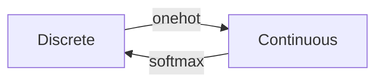
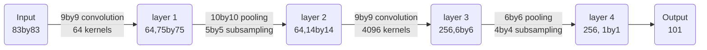

# Edx_ML_intro

------------------------------------------------------------------------------------
## Unit 0. Python set up

conda updates:  
https://github.com/ContinuumIO/anaconda-issues/issues/12135 [bluesblaz]  
https://stackoverflow.com/questions/45197777/how-do-i-update-anaconda  

Install packages:  
1. anaconda prompt:   
-activate (environment)  
-conda install ...  
2. Anaconda   

Pycharm
1. add configuration: add new-- choose python-- find the path to the xxx.py file  
2. add interpreter: excutable conda: select "conda.exe", chech the path by "which conda" in anaconda prompt.  
3. check the interpreter in the configuration  

------------------------------------------------------------------------------------
## Unit 1. Linear classifier
#---------------------------------------------------------------------------------------------------------# 
### L1. l2. linear classifiers 
#---------------------------------------------------------------------------------------------------------# \
A linear classifier $h, h(x; \theta_0, \theta) = sign(\theta \cdot x + \theta_0)$, i.e. the sign of the dot product of $\theta$ and $x$ plus $\theta_0$.   
Linear separability: $y_i \cdot h(x_i) > 0$ for all $i$.  

(1) Algorithm:    
Training error: $\varepsilon_n(\theta_0, \theta) = \frac{1}{n} \ \Sigma_{i=1}^n \[\[ y^{(i)} \\cdot (\theta \cdot x^{(i)} + \theta_0) \leq 0 \]\]$  
where $\[\[ \cdot \]\]$ returns 1 if the logical expression in the argument is true, and zero otherwis  

Learning algorithm:
 1)***Perceptron Algorithm***      
initialize $\theta$ and $\theta_0$ with 0  
> $\theta$ = $\theta$ (vector)  
> $\theta_0$ = 0 (scalar)  
> totally T epoches to iterate  
>> for t = 1 .. T do                       
>> (totally m data points)         
>>> for i = 1 .. m do    
>>> (misclassify data points)                             
>>> if $y^{(i)} \\cdot (\theta \cdot x^{(i)} + \theta_0) \leq 0$        
>>> then  
>>> $\ \theta  = \theta + y^{(i)} \cdot x^{(i)}$   
>>> $\ \theta_0 = \theta_0 + y^{(i)}$   
>return $\theta, \theta_0$  \


2）***Pegasos Algorithm***  
if $y^{(i)} \cdot (\theta \cdot x^{(i)}) \leq 1$, then update $\theta = (1 - \eta \lambda) \theta + \eta y^{(i)} x^{(i)}$; else, update $\theta = (1 - \eta \lambda) \theta$


#---------------------------------------------------------------------------------------------------------# 
### Lecture 3.1 Hinge loss, Margin boundaries and Regularization
#---------------------------------------------------------------------------------------------------------# \
***Decision boundary*** is the set of points $x$ which satisfy: $\theta \cdot x + \theta_0 = 0$   
***Margin Boundary*** is the set of points $x$ which satisfy: $\theta \cdot x + \theta_0 = \pm 1$    
So, the distance from the decision boundary to the margin boundary is $\frac{1}{||\theta||}$.   

***Regularization***:  $max \lbrace\frac{1}{||\theta||}\rbrace$ = $min \lbrace\frac{1}{2}||\theta||\rbrace$      
***Hinge loss***: $Loss_h (y^{(i)} \\cdot (\theta \cdot x^{(i)} + \theta_0)) = 0, (if \ z \geq 1); 1-z, (if \ z < 1)$, where $z = y^{(i)} \\cdot (\theta \cdot x^{(i)} + \theta_0)$     
***Objectives = average loss + regularization***        
$J(\theta, \theta_0) = \frac{1}{n} \Sigma_{i=1}^n Loss_h (y^{(i)} \\cdot (\theta \cdot x^{(i)} + \theta_0)) + \frac{\lambda}{2}||\theta||^2$,
where average loss: $\frac{1}{n} \Sigma_{i=1}^n Loss_h (y^{(i)} \\cdot (\theta \cdot x^{(i)} + \theta_0))$, regularization term: $\frac{\lambda}{2}||\theta||^2$, regularization paramter: $\lambda > 0 $.   

#---------------------------------------------------------------------------------------------------------# 
### Lecture 3.2 Linear Classification and Generalization 
#---------------------------------------------------------------------------------------------------------# 
Split training set into training set + validation set, and assess the loss of validation set.   

***Gradient descent***: Start $\theta$ at an arbitrary location: $\theta \leftarrow \theta_{start}$,    
update $\theta$ repeatedly with $\theta \leftarrow \theta - \eta \frac{\partial J(\theta, \theta_0)}{\partial \theta}$ until $\theta$  does not change significantly.  

***Stochastic gradient descent***: (looking at each individual item randomly) With stochastic gradient descent, we choose $i \in {1, ..., n}$ at random and update $\theta$ such that     
$\theta \leftarrow \theta - \eta \nabla \[Loss_h (y^{(i)} \\cdot (\theta \cdot x^{(i)} + \theta_0)) + \frac{\lambda}{2}||\theta||^2\]$    
if loss > 0: $\theta \leftarrow \theta - \eta (- y^{(i)} \cdot x^{(i)} + \lambda \theta)$;  
if loss = 0, $\theta \leftarrow \theta - \eta \lambda \theta$.   
Differently from perceptron, $\theta$ is updated even when there is no mistake.    


***Support vector machine***: SVMs can efficiently perform a non-linear classification using what is called the kernel trick, implicitly mapping their inputs into high-dimensional feature spaces.


#---------------------------------------------------------------------------------------------------------# 
### Lecture 4. Tuning the Regularization Hyperparameter by Cross Validation 
#---------------------------------------------------------------------------------------------------------# \
***Supervised Learning***     
Objective function (J = Loss + regularization($\alpha$R)) --> hyperparameter ($\alpha$, not determined through the optimization of J) --> cross validation     

(1) Support Vector Machine --> maximize the margin (more generalization)    
$D: {(x_i, y_i)} \ i = 1, 2, ..., n$   
distant from point i to the decision boundary: $\gamma = \frac{y_i \cdot \ (\theta \cdot x_i + \theta_0)}{||\theta||}$    
margin, $d = \min_{x_i, y_i \in D} \ \gamma (x_i, y_i, \theta, \theta_0)$

***Objective function = hinge loss + regularization***
***hinge loss*** = $L_h = f(\frac{\gamma}{|gamma_{ref}}) = 1 - \frac{\gamma}{|gamma_{ref}}, \gamma \leq \gamma_{ref}; 0, \ o.w $  


***objective function***     
$J(\theta, \theta_0) = \frac{1}{n} \Sigma_{i=1}^n Loss_h (\frac{\gamma}{\gamma_{ref}}) + \alpha \frac{1}{||\gamma||^2}$   

--> Maximize the margin   
$\theta$ can be scaled by any constant w.o changing the decision boundary.
$\gamma_{ref} = \frac{y^M \cdot \ (\theta \cdot x^M + \theta_0)}{||\theta||}$    
scale $\theta$ st. $(y^M \cdot \ (\theta \cdot x^M + \theta_0) = 1$    
therefore, $\gamma_{ref} = \frac{1}{\theta_0}$   
$J(\theta, \theta_0) = \frac{1}{n} \Sigma_{i=1}^n Loss_h (y^{(i)} \cdot (\theta \cdot x^{(i)} + \theta_0)) + \alpha ||\theta||^2$   

(2) Cross validation --> get $\alpha$   
n: segments      
   
accuracy score: $S(\alpha) = \frac{1}{n} \Sigma_{i=1}^n S(\alpha_i)$    
$\alpha^{\*} = argmin_{\alpha} S(\alpha)$ 


------------------------------------------------------------------------------------
## Unit 2. Nonlinear Classification, Linear regression, Collaborative Filtering
#---------------------------------------------------------------------------------------------------------# 
### Lecture 5. Linear regression
#---------------------------------------------------------------------------------------------------------# \
(1) ***Objective***   
1) Empirical risk 
$R_n (\theta) = \frac{1}{n} \Sigma_{i=1}^n Loss(y^{(i)} - \theta \cdot x^{(i)})$   
- Squared error loss 
$Loss(z) = \frac{z^2}{2}$       
$R_n (\theta) = \frac{1}{n} \Sigma_{i=1}^n Loss(y^{(i)} - \theta \cdot x^{(i)}) = \frac{1}{n} \Sigma_{i=1}^n \cdot \frac{1}{2} (y^{(i)} - \theta \cdot x^{(i)})^2$   
- Hinge loss  
$Loss_h (z) = 0, if z \geq 1; 1-z, o.w$

(2) ***Learning Algorithm***: gradient based approach   
$\nabla_{\theta} \ \frac{1}{2} (y^{(i)} - \theta \cdot x^{(i)})^2 = -(y^{(i)} - \theta \cdot x^{(i)}) \cdot x^{(i)}$  
initialize: $\theta = 0$     
learning step: $\theta = \theta + \eta (y^{(i)} - \theta \cdot x^{(i)}) \cdot x^{(i)}$   

SGD vs GD: Remark on SGD versus GD: Stochastic gradient descent (SGD) and gradient descent (GD) differ in their batch sizes. For "very" convex problems, GD can converge in fewer steps than SGD (with the same timesteps for fair comparison, and also taking moving averages of SGD's answer, for fair comparison). But for general nonlinear problems, we can't make a universal claim about which takes fewer steps to converge. For example, the randomness in SGD can help us escape critical points such as saddle points that would get GD stuck.    

(3) ***Closed form solution***        
$\nabla_{n}(\theta) = - \frac{1}{n} \Sigma_{i=1}^n (y^{(i)} - \theta \cdot x^{(i)}) \cdot x^{(i)} = 0$,      
if $x_1, ..., x_n \ in \ ℝ^d, n ≫ d, then \ \theta = A^{-1} b, where \ A = \frac{1}{n} \Sigma_{i=1}^n x^{(i)} (x^{(i)})^T, b = \frac{1}{n} \Sigma_{i=1}^n y^{(i)} x^{(i)}$  

(4) ***Regularization*** (Ridge and Lasso)        
***Ridge Regression***    
$J_{\lambda, \theta} (\theta) = R_n(\theta) + \frac{\lambda}{2} ||\theta||^2$    
learning step: $\theta = (1 - \eta \lambda) \theta + \eta (y^{(i)} - \theta \cdot x^{(i)}) \cdot x^{(i)}$      

#---------------------------------------------------------------------------------------------------------# 
### Lecture 6. Non-linear classifier  
#---------------------------------------------------------------------------------------------------------# \
(1) Higher order feature vectors         
map $x \in \ ℝ^d$ to $\phi(x) \in ℝ^p$     
e.g $\phi(x) = \[\phi_1(x), \phi_2(x)\]^T = \[x, x^2\]^2$   
$\phi(x) = \[x_1, x_2, x_1^2 + x_2^2\]^T$: hyperbolic paraboloid

(2) Non-linear classifier     
$h(x; \theta, \theta_0) = sign(\theta \cdot \phi(x) + \theta_0)$    

(3) Kernels (inner product)   
Computing the inner product of two feature vectors can be computationally cheap.     
$\phi(x) = \[x_1, x_2, x_1^2 + x_2^2 + \sqrt{2} x_1 x_2\]^T$    
$\phi(x') = \[{x'}_1, {x'}_2, {x'}_1^2 + {x'}_2^2 + \sqrt{2} {x'}_1 {x'}_2\]^T$     
$K(x, x') = \phi(x) \cdot \phi(x') = (x, x') + (x, x')^2$    

In general, $K(x, x') = \phi(x) \cdot \phi(x') = (1 + x x')^p, p = 1, 2,...$   

Example kernel: https://stats.stackexchange.com/questions/152897/how-to-intuitively-explain-what-a-kernel-is       
$k(x, y) = \phi(x)^T \phi(y) = (1 + x^T y)^2, \ with \ x,y \in ℝ^2, x=(x_1, x_2), y=(y_1, y_2)$, get expression for $\phi(x)$     
$k(x, y) = (1 + x^T y)^2 = (1 + x_1 y_1, x_2 y_2)^2 = 1 + x_1^2y_1^2 + x_2^2y_2^2 + 2x_1 y_1 + 2x_2 y_2 + 2x_1x_2y_1y_2$      
Therefore $\phi(X) = \phi(x_1, x_2) = (1, x_1^2, x_2^2, \sqrt{2} x_1,  \sqrt{2} x_2,  \sqrt{2} x_1 x_2)$

(4) Kernel Perceptron Algorithm    
From ***Perceptron algorithm***, we get $\theta = \Sigma_{j=1}^n \alpha_j y^{(j)} \phi(x^{(j)})$    
$initial \ \theta = 0$   
$run \ through \ i = 1, ..., n$   
$\ if \ y^{(i)} \theta \cdot \phi(x^{(i)}) \leq 0,$   
$\ \ \theta \leftarrow \theta + y^{(i)} \phi(x^{(i)})$    
Here, $\theta \cdot \phi(x^{(i)}) = \Sigma_{j=1}^n \alpha_j y^{(j)} \phi(x^{(j)}) \cdot \phi(x^{(i)}) = \Sigma_{j=i}^n \alpha_j y^{(j)} \cdot K(x^{(j)}, x^{(i)})$   

(5) Kernel composition rules     
-  $K(x, x') = 1$ is a kernel.
-  Let $f: ℝ^d \rightarrow ℝ$ and $K(x, x')$ is a kernel, then so it $\tilde{K}(x, x') = f(x) K(x, x') f(x')$.
-  If $K_1(x, x')$ and $K_2(x, x')$ are kernels,  $K_1(x, x') + K_2(x, x')$ is a kernel.
-  If $K_1(x, x')$ and $K_2(x, x')$ are kernels,  $K_1(x, x') \cdot K_2(x, x')$ is a kernel.

(6) Radial basic kernel   
Ref: https://www.cs.toronto.edu/~duvenaud/cookbook/   
$K(x, x') = \exp{(- \frac{1}{2} ||x - x'||^2)}$

(7) Other non-linear classifier: random forest


#---------------------------------------------------------------------------------------------------------# 
### L7. Recommender System
#---------------------------------------------------------------------------------------------------------# \

(1) K-Nearest Neighbor Method    
$\hat{Y_{ai}} = \frac{\Sigma_{b \in KNN(a)} \ sim(a, b) Y_{bi}}{\Sigma_{b \in KNN(a)} \ sim(a, b)}$        
$sim(a, b)$ can choose euclidean distance ||x_a - x_b||, cosince similarity $cos(\theta) = \frac{x_a \cdot x_b}{||x_a|| \cdot ||x_b||}$, etc.      

Drawbacks: need to manually compute the similarities, can be very difficult to features similarities in subgroups.   

(2) Collaborative filtering
1) Naive approach (very bad performance)
Considering the objectives of linear regression:     
$J(X) = \Sigma_{a, i \in D} \frac{(Y_{ai} - X_{ai})^2}{2} + \frac{\lambda}{2} \Sigma_{(a,i)} X_{ai}^2$.    
For $X_{ai} \in D$, $\frac{\partial{J}}{\partial{X_{ai}}} = (1 + \lambda) X_{ai} - Y_{ai}$, therefore $X_{ai} = \frac{Y_{ai}}{1 + \lambda}$.    
For $X_{ai} \notin D$, $\frac{\partial{J}}{\partial{X_{ai}}} = \lambda \cdot X_{ai}$, therefore $X_{ai} = 0$.    

2) Collaborative Filtering with Matrix Factorization    
Assumption: X is low rank    
Rank 1: O(n, m) --> O(n + m), $X = UV^T$, $X_{ai} = u_a \cdot v_i$ (oversimplification)   
Rank 2: $X = UV^T$, $X \in ℝ^{a \times i}, U \in ℝ^{a \times 2}, V \in ℝ^{i \times 2}$   
...  

(3) Alternating minimization    
assume $X_{ai} = u_a v_i$ rank 1,   
$J(U, V) = \Sigma_{(a, i) \in D} (y_{ai} - u_a v_i)^2 + \frac{\lambda}{2} \Sigma_{a=1}^n u_a^2 + \frac{\lambda}{2} \Sigma_{i=1}^n v_i^2$    
start with an initial $v$ (random initialization)--> solve $u'$, and input $u'$ --> solve $v'$ --> iritate until converge    


#---------------------------------------------------------------------------------------------------------# 
### Python Implementation
#---------------------------------------------------------------------------------------------------------# \
http://kehang.github.io/basic_project/2017/04/02/mnist-classifiers-exploration/      
(1) Linear Regression with Closed Form Solution    

```ruby
def closed_form(X, Y, lambda_factor):
    """
    Computes the closed form solution of linear regression with L2 regularization

    Args:
        X - (n, d + 1) NumPy array (n datapoints each with d features plus the bias feature in the first dimension)
        Y - (n, ) NumPy array containing the labels (a number from 0-9) for each
            data point
        lambda_factor - the regularization constant (scalar)
    Returns:
        theta - (d + 1, ) NumPy array containing the weights of linear regression. Note that theta[0]
        represents the y-axis intercept of the model and therefore X[0] = 1
    """
    d = X.shape[1]
    A = np.linalg.inv(np.dot(X.T, X) + lambda_factor * np.identity(d))
    theta = A.dot(X.T).dot(Y)

    return theta


def compute_test_error_linear(test_x, Y, theta):
    test_y_predict = np.round(np.dot(test_x, theta))
    test_y_predict[test_y_predict < 0] = 0
    test_y_predict[test_y_predict > 9] = 9
    return 1 - np.mean(test_y_predict == Y)
```

(2) Support Vector Machine       
```ruby
def one_vs_rest_svm(train_x, train_y, test_x):
    """
    Trains a linear SVM for binary classifciation

    Args:
        train_x - (n, d) NumPy array (n datapoints each with d features)
        train_y - (n, ) NumPy array containing the labels (0 or 1) for each training data point
        test_x - (m, d) NumPy array (m datapoints each with d features)
    Returns:
        pred_test_y - (m,) NumPy array containing the labels (0 or 1) for each test data point
    """
    Lsvc = LinearSVC(C = 0.01, random_state = 0)
    # (1) C: float, default=1.0
    # Regularization parameter. The strength of the regularization is inversely proportional to C.
    # Must be strictly positive. The penalty is a squared l2 penalty.
    # (2) random_state: RandomState instance or None, default=None
    # Controls the pseudo random number generation for shuffling the data for probability estimates.
    Lsvc.fit(train_x, train_y)
    pred_test_y = Lsvc.predict(test_x)

    return pred_test_y


def multi_class_svm(train_x, train_y, test_x):
    """
    Trains a linear SVM for multiclass classifciation using a one-vs-rest strategy

    Args:
        train_x - (n, d) NumPy array (n datapoints each with d features)
        train_y - (n, ) NumPy array containing the labels (int) for each training data point
        test_x - (m, d) NumPy array (m datapoints each with d features)
    Returns:
        pred_test_y - (m,) NumPy array containing the labels (int) for each test data point
    """
    Lsvc = LinearSVC(C = 0.1, random_state = 0, multi_class = 'ovr')
    Lsvc.fit(train_x, train_y)
    pred_test_y = Lsvc.predict(test_x)

    return pred_test_y


def compute_test_error_svm(test_y, pred_test_y):
    return 1 - np.mean(pred_test_y == test_y)
```

(3) Multinomial (***Softmax***) Regression and Gradient Descent     
Hardmax: binary outcome(scores) --(sigmoid function)--> Softmax: probability output  
3.1) ***softmax function*** h,
```math
h(x) = \frac{1}{\Sigma_{j=0}^{k-1} \exp(\theta_j \cdot x / \tau)} \begin{bmatrix}\frac{1}{\exp(\theta_0 \cdot x / \tau)}\\ \frac{1}{\exp(\theta_1 \cdot x / \tau)}\\ \vdots \\ \frac{1}{\exp(\theta_{k-1} \cdot x / \tau)} \end{bmatrix},
```
where $\tau > 0$ is the temperature parameter.  

***Loss function and derivative***:      
Softmax: $S: ℝ^n \rightarrow ℝ^n$, $S_j = p_j = \frac{\exp(z_j)}{\Sigma_{l=1}^{n} \exp{z_l}}$, $z_j = np.matmul(\theta, x_j)/\tau$,      
Loss function: $L = - \Sigma_{j}^{n}  y_j \log{p_j}, j = 1, ..., n$, where $y$ is the output class numbered 1...n a is any n-vector, eg. $\[0, 0, ...1, ...,0\]$.    
Derivative: $\frac{\partial{p_j}}{\partial{z_i}} = p_i (1 - p_i), i = j$,   
$\frac{\partial{p_j}}{\partial{z_i}} =  - p_i p_j, i \neq j$,    
therefore, $\frac{\partial{L}}{\partial{z_i}} = -(y_i(1 - p_i) + \Sigma_{k \neq i}^{n} -p_i y_k) = p_i y_i - yi + \Sigma_{k \neq i}^{n} p_i y_k) = p_i (\Sigma_{k}^{n} y_i) - y_i = p_i - y_i$. ($\Sigma_{k}^{n} y_i = 1$)     

      

- convex, easy to compute     
- bounded gradients, (0, 1)     
- tight surragate for 0-1 loss: Softma loss > 0-1 loss, if softmax loss ->0, then 0-1 loss -> 0     


The terms $\exp(\theta_j \cdot x / \tau)$ may be very large or very small, due to the use of the exponential function. To deal with this, we can simply subtract some fixed amount  from each exponent to keep the resulting number from getting **too large**.   
```math
h(x) = \frac{1}{\Sigma_{j=0}^{k-1} \exp((\theta_j \cdot x) / \tau) -c} \begin{bmatrix}\frac{1}{\exp((\theta_0 \cdot x) / \tau) -c}\\ \frac{1}{\exp((\theta_1 \cdot x) / \tau) -c}\\ \vdots \\ \frac{1}{\exp((\theta_{k-1} \cdot x) / \tau)-c} \end{bmatrix},
```

A suitable choice for this fixed amount is $c = \max_{j} \theta_j \cdot x / \tau$.      

--> Allow continuous methods to solve discrete tasks      
--> Model uncertainty: key to learning, to have calibrated predictions     



3.2) ***Gradient descent***   
For a particular $\theta_m$,    
```math
\begin{align}  
\frac{\partial{J(\theta)}}{\partial{\theta_m}} &= \frac{\partial}{\partial{\theta_m}} [ - \frac{1}{n} [ \Sigma_{i=1}^{n} \Sigma_{j=0}^{k-1} [[y^{(i)} == j ]] \log{p(y^{(i)} = j| x^{(i)},\theta)} ]+ \frac{\lambda}{2} \Sigma_{j=0}^{k-1} \Sigma_{i=0}^{d-1} \theta_{ji}^2 ]  \\
&= - \frac{1}{\tau n} \Sigma_{i=1}^{n} [ x^{(i)} ([[ y^{(i)} == m ]] -p(y^{(i)} = m| x^{(i)},\theta)) ] + \lambda \theta_m
\end{align}
```
update each step $\theta = \leftarrow \theta - \alpha \nabla_{\theta} J(\theta)$, where $\alpha$ is learning rate.    


3.3) ***Temperate parameter effects***   
a) Probability
Increasing temperature parameter would decrease the probability of a sample $x^{(i)}$ being assigned a label that has a large $\theta$, and increase for labels with small $\theta$. The mathematic explanation is following:   
$P_j = \frac{\exp{(\theta_k x/ \tau)}}{\Sigma_k \exp{(\theta_k x/ \tau)}}$    
$\frac{\partial{\log{(P_j)}}}{\partial{\tau}} = \frac{1}{\tau^2} \[ \frac{c \theta_k x}{\Sigma_k \exp{(\theta_k x/ \tau)}} - \theta_j x\]$     
The first term is the bracket is weighted average of $theta x$, so if $theta_j x$ is large, the value of the brackect will be negative, leading to negative $\frac{\partial{\log{(P_j)}}}{\partial{\tau}}$.    

b) Test error   
https://jdhao.github.io/2022/02/27/temperature_in_softmax/       
Smaller temperature leads to less variance --> smaller test error     
Increasing temperature parameter makes probability of large- $\theta$ label decrease and that of small- $\theta$ label increase, the probability distribution becomes **more uniform** as temperature parameter icreases.    


(4) Features: Dimensionality Reduction via ***PCA***             
By projecting an $n \times d$ dataset $X$ onto $k \leq d$ of these directions, we get a new dataset of lower dimension that reflects more variation in the original data than any other $k$-dimensional linear projection of $X$. By going through some linear algebra, it can be proven that these directions are equal to the $k$ eigenvectors corresponding to the $k$ largest eigenvalues of the covariance matrix $\tilde{X}^T\tilde{X}$, where $\tilde{X}$ is a centered version of our original data.     


(5) Features: ***Cubic Features***      
Cubic Features maps an input vectio $x = \[x_1, ..., x_d\]$ into a new feature vector $\phi (x)$, defined so that for any $x, x' \in \mathbb{R}^d$:      
$\phi(x)^T \phi(x') = (x^T x'+1)^3$   

(6) ***Kernel Methods***   
Recall the kernel perceptron algorithm we learned in the lecture. The weights $\theta$ can be represented by a linear combination of features:      
$\theta = \Sigma_{i=1}^n \alpha^{(i)} y^{(i)} \phi(x^{(i)})$.    

In the softmax regression fomulation, we can also apply this representation of the weights:
$\theta_j = \Sigma_{i=1}^n \alpha_j^{(i)} y^{(i)} \phi(x^{(i)})$.    

```math  
\begin{align}
h(x) 
&= \frac{1}{\Sigma_{j=0}^{k-1} \exp((\theta_j \cdot \phi(x^{(i)}) / \tau) -c} \begin{bmatrix}\frac{1}{\exp((\theta_0 \cdot \phi(x^{(i)}) / \tau) -c}\\ \frac{1}{\exp((\theta_j \cdot \phi(x^{(i)}) / \tau) -c}\\ \vdots \\ \frac{1}{\exp((\theta_{k-1} \cdot \phi(x^{(i)}) / \tau)-c} \end{bmatrix} \\

&= \frac{1}{\Sigma_{j=0}^{k-1} \exp((\Sigma_{i=1}^n \alpha_j^{(i)} y^{(i)} \phi(x^{(i)} \cdot \phi(x^{(i)}) / \tau) -c} \begin{bmatrix}\frac{1}{\exp((\Sigma_{i=1}^n \alpha_1^{(i)} y^{(i)} \phi(x^{(i)}\cdot \phi(x^{(i)}) / \tau) -c}\\ \frac{1}{\exp((\Sigma_{i=1}^n \alpha_2^{(i)} y^{(i)} \phi(x^{(i)} \cdot \phi(x^{(i)}) / \tau) -c}\\ \vdots \\ \frac{1}{\exp((\Sigma_{i=1}^n \alpha_k^{(i)} y^{(i)} \phi(x^{(i)} \cdot \phi(x^{(i)}) / \tau)-c} \end{bmatrix}
\end{align}
```
We actually do not need the real mapping $\phi(x)$, but the inner product between two features after mapping: $\phi(x_i)\phi(x)$, where $x_i$ is a point in the training set and $x$ is the new data point for which we want to compute the probability. If we can create a kernel function $K(x,y) = \phi(x) \cdot \phi(y)$, for any two points $x$ and $y$, we can then kernelize our softmax regression algorithm.


------------------------------------------------------------------------------------
## Unit 3. Neural Networks
#---------------------------------------------------------------------------------------------------------# 
### L8. Introduction to Feedforward Neural Networks
#---------------------------------------------------------------------------------------------------------# 

- Implement a ***feedforward neural networks*** from scratch to perform image classification task.
- Write down the gradient of the loss function with respect to the weight parameters using ***back-propagation algorithm*** and use ***SGD*** to train neural networks.
- Understand that ***Recurrent Neural Networks (RNNs)*** and ***long short-term memory (LSTM)*** can be applied in modeling and generating sequences.
- Implement a ***Convolutional neural networks (CNNs)*** with machine learning packages.


#---------------------------------------------------------------------------------------------------------# 
### L9. Feedforward Neural Networks, Back Propagation and SGD
#---------------------------------------------------------------------------------------------------------# 
#### (1) ***Feedforward Neural Networks Intro*** 
Neural networks are models in which the **feature representation is learned jointly with the classifier** to improve classification performance. 

A neural network unit: **input layer** + ***hidden layer*** + **output layer** \
1)Inpput layer: $x$ \
2)Hidden layer: introducing redundancy\
$z = w_0 + x \cdot w$ \
e.g, map x1, x2 to 10 dimentional space (z1, ..., z10) by multiplying (w1, ..., w10) --> easier to classify
3)Outout layer: \
$f(z)$: usually a non-linear function called ***activation function***, e.g., ***rectified linear function (ReLU)***, ***hyperbolic tangent function: tanh(z)***, etc. \
-***rectified linear function (ReLU)***: $f(z) = max(0, z)$.\
-***hyperbolic tangent function***: $tanh(z) = \frac{exp{z} - exp{-z}}{exp{z} + exp{-z}} = 1 - \frac{2}{exp{2z} + 1}$. 


#### (2) ***Back Propagation and SGD*** 

1)***Back Propagation Algorithm***: 

With L hidden layers: $Loss(y; f(x, w)) = Loss(y; f_L) = (y - f_L)^2$ \
for $i = 1, ..., L: z_i = f_{i-1} w_i, where f_{i-1} = f(z_{i-1})$ \
$z_1 = x w$ \


2)***SGD***: Gradient for $w_1$: 

$\frac{\partial{L}}{\partial{w_1}} = x(1-f_1^2)(1-f_2^2) \cdots (1-f_L^2) w_2 w_3 \cdots w_L (2(f_L - y))$ 


3)Characteristics: 

-For multi-layer neural networks the loss function is no longer convex and any stochastic gradient descent (SGD) method is not guaranteed to reach global optimum \
-Larger models tend to be easier to learn because their units need to be adjusted so that they are, collectively sufficient to solve the task \
-Initialization plays a role in finding a good solution during training of neural networks \


#---------------------------------------------------------------------------------------------------------# 
### L10. 11. Recurrent Neural Networks (for modeling sequences)
#---------------------------------------------------------------------------------------------------------#

#### (1) Temporal/sequence problems: (time trend, language)

-For a feed-forward NN: \
Using historical data to predict the next point (sliding window: e.g. 5 previous data points --> next data point). \
But it requires the enginnering of "history" into the feature map.

-RNN: learn how to encode the "history" into a vector 


#### (2) RNN***: learning to encode/decode 

-language modeling: predict the whole sentence \
-sentimanet classification \
-machine translation 


1)***Encoding*** 

$s_t = tanh(W^{s,s} s_{t-1} + W^{s,x} x_t)$, \
$s_t \in \mathbb{R}^{m \times 1}$ new context, $s_{t-1} \in \mathbb{R}^{m \times 1}$ context, $W^{s,s} \in \mathbb{R}^{m \times m}$, $x_{t} \in \mathbb{R}^{d \times 1}$ new information, $W^{s,x} \in \mathbb{R}^{m \times d}$.

-Input is received at each layer (per word), not just at the beginning as in a typical fee-forward network. \
-The number of layer varies, depending on the lengths of the sentence. \
-Parameter of each layer are shared (same RNN at each step). (e.g. (null)--(Efforts)--> $\theta$--(and)--> $\theta$--(courage)--> $\theta$--(are)--> $\theta$-->output: sentence as a vector)

2)***Gating and long short-term memory networks (LSTM)***

-***Simple gated RNN***: \
$g_t = sigmoid(W^{g,s} s_{t-1} + W^{g,x} x_t), \ \in \[0, 1\]$ \
$s_t = (1-g_t) ⊙ s_{t-1} + g_t ⊙ tanh(W^{s,s} s_{t-1} + W^{s,x} x_t)$ \
the sign $⊙$ denotes element-wise multiplication.

-***LSTM***: \
context $\[c_{t-1}, h_{t-1}\]$ --(new information $x_t$)--> new context $\[c_{t}, h_{t}\]$ \
**Forget gate**: $f_t = sigmoid(W^{f,h} h_{t-1} + W^{f,x} x_t)$ \
**Input gate**: $i_t = sigmoid(W^{i,h} h_{t-1} + W^{i,x} x_t)$ \
**Output gate**: $o_t = sigmoid(W^{o,h} h_{t-1} + W^{o,x} x_t)$ \
**Memory cell**: $c_t = f_t ⊙ c_{t-1} + i_t ⊙ tanh(W^{c,h} h_{t-1} + W^{c,x} x_t)$ \
**Visible state**: $h_t = o_t ⊙ tanh(c_t)$ 


3)***LSTM*** Example: 

E.g. layer 1 -> layer 2-> layer 3 (output) \
For $l = 1, ..., L$ layer: \
$w^l_{jk}$ is the weight from the $k^{th}$ neuron in the $(l-1)^{th}$ layer to the $j^{th}$ neuron in the $l^{th}$ layer; \
$b^l_j is the bias of the $j^{th}$ neuron in the $l^{th}$ layer, $a^l_j$ is the activation of $j^{th}$ neuron in the $l^{th}$ layer. \
$a^l_j = f(\Sigma_k w^l_{jk} a_k^{l-1} + b^l_j)$. \
Loss = $C(a^L)$ \
Let weight inputs to $d^{th}$ neuron in $l^{th}$ layer is $z^l = w^l a^{l-1} + b^l$, where $z^l \in \mathbb{R}^d$, $a^l = f(z^l)$. And the error of $j^{th}$ neuron in the $l^{th}$ layer is $\delta_j^l = \frac{\partial{C}}{\partial{z_j^l}}$, $\delta^l \in \mathbb{R}^d$ denotes the full vector of errors associated with $l^{th}$ layer. \
---3.1)**Computing the Error**---: \
-)*Assume there are d outputs from the last layer* (i.e. $a^L \in \mathbb{R}^d$). *What is* $\delta_j^L$ *for the last layer?:* \
$\delta_j^L = \frac{\partial{C}}{\partial{z_j^L}} = \frac{\partial{C}}{\partial{a_j^L}} \cdot \frac{\partial{a_j^L}}{\partial{z_j^L}} = \frac{\partial{C}}{\partial{a_j^L}} \cdot f'(z_j^L)$ \
-)*What is* $\delta_j^l$ *for all* $l \neq L$: \
$\delta_k^{l+1} = \frac{\partial{C}}{\partial{z_k^{l+1}}} = \frac{\partial{C}}{\partial{a_j^{l}}} \frac{\partial{a_j^{l}}}{\partial{z_k^{l+1}}} = \frac{\partial{C}}{\partial{a_k^{l+1}}} * (w^l)^{-1}$ -> for all $k$ neurons in the $(l+1)^{th}$ layer: $\frac{\partial{C}}{\partial{a_j^{l}}} = \Sigma_k w_{jk}^l \delta_k^{l+1}$ \
$\delta_j^l = \frac{\partial{C}}{\partial{z_j^l}} = \frac{\partial{C}}{\partial{a_j^l}} \frac{\partial{a_j^l}}{\partial{z_j^l}} = \Sigma_k w_{jk}^l \delta_k^{l+1} f'(z_j^l)$ \
---3.2)**Parameter Derivatives**---: \
$\frac{\partial{C}}{\partial{w_{jk}^l}} = \frac{\partial{C}}{\partial{z_j^l}} \frac{\partial{z_j^l}}{\partial{w_{jk}^l}} = \delta_j^l a_k^{l-1}$ \
$\frac{\partial{C}}{\partial{b_{j}^l}} = \delta_j^l$


#### (3) ***Markov Models*** 

(kth order Markov Models --> Feed-forward NN --> RNN)

1)***Markov Language Models*** \
Model setup: e.g. \
$<$ beg $>$ The lecture leaves me UNK $<$ end $>$ \
&nbsp;  &emsp; $w_0$ &ensp; &nbsp; $w_1$ &nbsp; &emsp; $w_2$  &emsp; $w_3$  &nbsp; $w_4$  &nbsp; $w_5$ &emsp; &nbsp; $w_6$ \
$<$ *beg* $>$: start of sentence, $<$ *end* $>$: end of sentence, *UNK*: unknown words 

Probability table: 

|             | The       | lecture   | is        | UNK       | \<end\>   |
| -------     | ---       | ---       | ---       | ---       | ---       |
| \<beg\>     | 0.7       | 0.1       | 0.1       | 0.1       | 0.0       |
| The         | 0.0       | 0.6       | 0.1       | 0.1       | 0.0       |
| lecture     | 0.0       | 0.0       | 0.7       | 0.1       | 0.2       |
| is          | 0.1       | 0.2       | 0.1       | 0.6       | 0.0       |
| UNK         | 0.1       | 0.2       | 0.1       | 0.3       | 0.3       |

$<$ beg $>$ lecture is UNK $<$ end $>$ \
P(lecture|\<beg\>) P(is|lecture) P(UNK|is) P(\<end|>|UNK) = 0.1 * 0.7 * 0.6 * 0.3


2)***Markov Models to Feed-forward NN*** \
Weights: $z_i = \Sigma_j \phi(x_j) W_{jk} + W_{0k}$, $\phi(x_j)$ onehot input. \
Softmax output layer: $p_k = p(w_{i=k}|w_{i-1}) = \frac{\exp{z_k}}{\Sigma_j \exp{z_j}}$ --> $p_k \leq 0, \ \Sigma_k p_k = 1$. 

**Comparison: Markov Models vs Feed-forward NN**: \
-Feed-forward NN contains a fewer number of parameters. \
-We can easily control the complexity of feedforward NN by introducing hidden layers. \
*Suppose you have a word vocabulary of size 10 (including <beg> and <end>), and you were using a trigram language model to predict the next word.* \
*Markov Model: 1000 parameters (100 choices for the previous two words, and 10 choices for the next word, leading to a size of 1000).* \
*Feed-forward NN: 210 parameters (an input layer of size 20 and an output layer of size 10, leading to a weight matrix of size 200. We add 10 parameters for the bias vector).* \

 
3)***RNN***: The hidden state is fed in as input for the next step \
-***Encoding***: \
**State**: $tanh(W^{s,s} s_{t-1} + W^{s,x} x_t)$ \
**Output disdribution**: $softmax(W^0 s_t)$ 
 
-***Decoding***: \
Unlike in encoding, at each step, an output distribution $p_t$ is produced in a decoding RNN. \
An RNN model to translate images into sentences: Feeding the sampled output as part of the input to the next time step. (only in the test samples, not training samples)

 

#### (4) Word Embedding (vs onehot)
Word similarity: use in the same context, e.g. cat vs dog. \
input --> (demension reduction) values representing distances --softmax--> output (same dimension as input)

 
#---------------------------------------------------------------------------------------------------------# 
### L12. Convolutional neural networks (CNNs)
#---------------------------------------------------------------------------------------------------------#

#### (1) Feed-forward NNs vs CNNs
e.g., image classifiction (1000*1000 pixels): \
-Feed-forward NNs: if the pic is moved --> prediction will not be accurate. \
-CNNs: input -->(Patch classifier, e.g., 11*11)--> feature map --(pooling with defined stride, e.g, max(5*5 pixels), disregard the location within the patch)--> pooled map \

**Characteristics**: shared parameters, 11*11=121.
 
#### (2) CNNs
e.g., multiple convolution layers to extract different feature maps. 
 

 

#### （3）Convolution/Cross Correlation

   

-convolution: $(f \ast g)(t) = \int_{-\infty}^{\infty} f(\tau) g(t - \tau) d\tau$ \
-cross correlation: $(f \ast g)(t) = \int_{-\infty}^{\infty} f(\tau) g(\tau) d\tau$

Usually, f(t) is signal, g(t) is filter (learned) --> convolution and cross correlation are equivalent in CNNS --> using cross correlation for easier computation.\


 
#### （4）Attention

1)Too many hidden units: takes up more memory/ may overfit the training data/ will take longer to train

2)Too many epochs: In general too many epochs may cause your model to over-fit the training data. It means that your model does not learn the data
 
3)Improving accuracy: batch size/learning rate/momentum/activation function/models architecture...


------------------------------------------------------------------------------------
## Unit 4. Unsupervised Learning
#---------------------------------------------------------------------------------------------------------# 
### L13. Clustering
#---------------------------------------------------------------------------------------------------------#

#### (1) Introduction
Example: image quantization (1024*1024 resolution $\cdot$ 24 bits(RGB) = 3M in size) \
--> simplification: 32 colors = $2^5$ to encode, therefore 1024 $\times$ 1024 $\cdot$ 5 + 32 $\cdot$ 24 = 646 K in size 
 

Definition of **Clustering**: \
The training set $S{x^{(i)}, i = 1, ..., n}$ into K cluster, \
Output: $C_1 \cup ... \cup C_K = {x^{(1)}, ..., x^{(n)}}$, and $C_i \cap C_j = \emptyset, i \neq j$.
 

#### (2) Similarity Measures-Cost functions
$Cost(C, z) = \Sigma_{i \in C} dist(x^{(i)}, z), z$ is the representative. \
Distance function choise: Euclidean distance, Cosine distance, etc. \
--> Euclidean distance: $Cost(C_i, ..., C_k, z_i, ..., z_k) = \Sigma_j^k \Sigma_{i \in C_j} ||x^{(i)}, z_j||^2$

!!!! However, too expensive--> the number of cost needs to be estimated grows exponentially with K.

 
#### (3) K-means Algorithm
1)Randomly select $z^{(1)}, ..., z^{(k)}$.\
2) Iteration: \
-Assign all points x to the closest z. $Cost(z^{(1)}, ..., z^{(k)}) = \Sigma_{i=1}^n \min_{j=1, ..., k} ||x^{(1)} - z^{(j)}||^2$\
-Given $C_1, ..., C_k$, find the best representative z, $Cost(C_1, ..., C_k) = \min_{z^{(1)}, ..., z^{(k)}} \Sigma_{j=1}^k \Sigma_{i \in C_j} ||x^{(1)} - z^{(j)}||^2$.

Notes: \
-Finding representative z: $z_j$ is the centroid of (center of mass assuming each $x^{(i)}$ has equal mass) of the $j$th cluster\
gradient: $\nabla_{z_j} (\Sigma_{i \in C_j} ||x^{(1)} - z_j||^2) = \Sigma_{i \in C_j} -2(x^{(i)} - z_j)$ --> $z_j = \frac{\Sigma_{i \in C_j} x^{(i)}}{|C_j|}$.
-It will converge to the local minimum: depends on the initialization --> try different initialization/keep initial $z_j$ well spread out.
 
Drawbacks: \
-Manual choice of K.\
-Not robust to outliers. \
-Does not scale well with increasing number of dimensions
 

 


 

 

 
 


 
